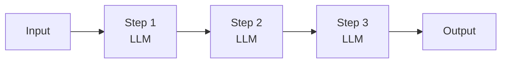
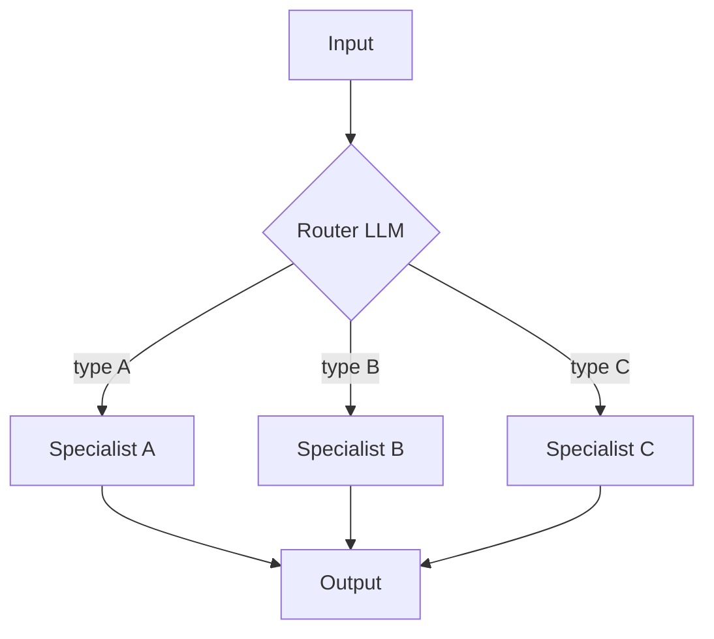
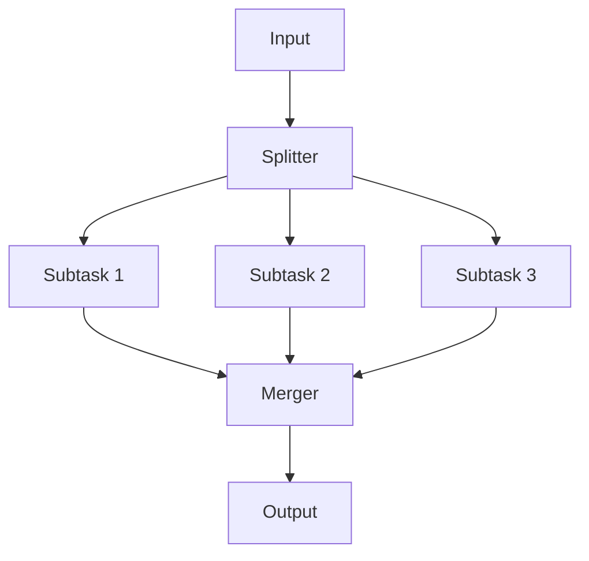
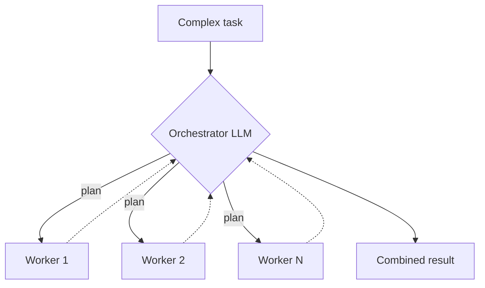
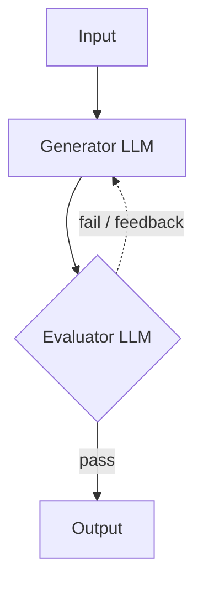
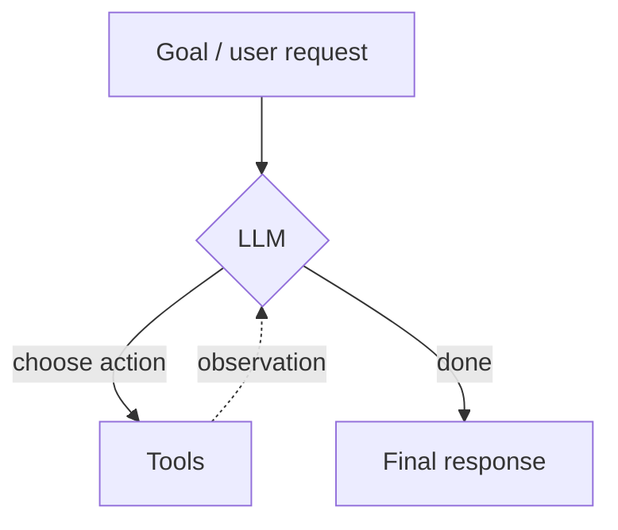
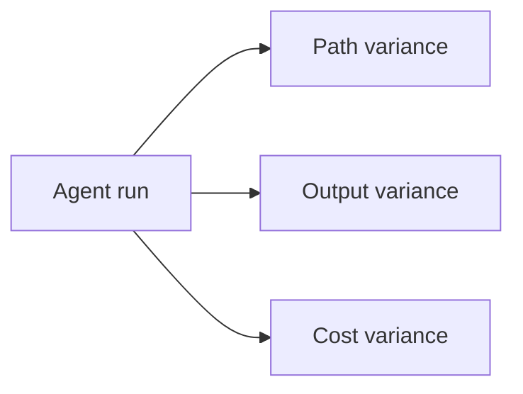
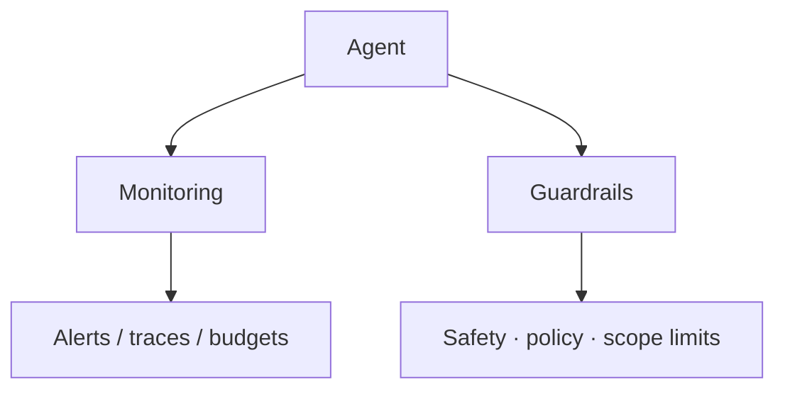

## Agents vs Workflows

**AI agents** are programs where LLM outputs control the workflow.

| Concept       | Definition                                                                                                                   |
| ------------- | ---------------------------------------------------------------------------------------------------------------------------- |
| **Workflows** | Systems where LLMs and tools are orchestrated through predefined code paths                                                  |
| **Agents**    | Systems where LLMs dynamically direct their own processes and tool usage, maintaining control over how they accomplish tasks |

## Workflow Design Patterns

### 1. Prompt chaining

Decompose a task into sequential sub-tasks. Each step's output feeds the next.

**When to use:** Clear multi-stage pipelines (extract → transform → generate).

### 2. Routing

Direct an input into a specialized sub-task so each path owns a single concern.

**When to use:** Classification, triage, or domain-specific handlers.

### 3. Parallelisation

Break work into independent subtasks and run them concurrently, then merge results.

**When to use:** Independent analyses, multi-source retrieval, batch scoring.

### 4. Orchestrator–worker

An orchestrator LLM dynamically breaks a complex task into subtasks, assigns workers, and combines their results.

**When to use:** Open-ended problems where the subtask structure is not known up front.

### 5. Evaluator–optimizer

One LLM produces output; another validates (and may request revision) until quality criteria are met.

**When to use:** Quality-sensitive generation (code, writing, structured data) with clear success criteria.

## Agents

Agents are **open-ended**: they use feedback loops and have **no fixed path**.

Typical traits:

- Open-ended goals
- Feedback loops (act → observe → decide)
- No fixed control path; the model chooses next steps

---

## Risks of Agent Frameworks

| Risk                 | Description                                              |
| -------------------- | -------------------------------------------------------- |
| Unpredictable path   | The sequence of steps can vary run to run                |
| Unpredictable output | Results may be inconsistent or hard to reproduce         |
| Unpredictable cost   | Extra loops and tool calls can inflate token / API spend |

---

## Mitigation

| Control        | Purpose                                                      |
| -------------- | ------------------------------------------------------------ |
| **Monitor**    | Observe paths, outputs, latency, and cost                    |
| **Guardrails** | Keep agents safe, consistent, and within intended boundaries |

